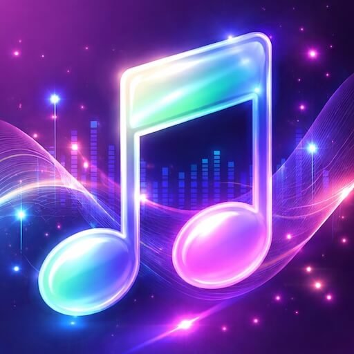
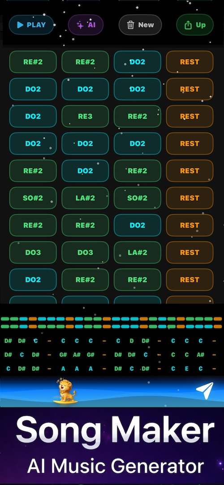
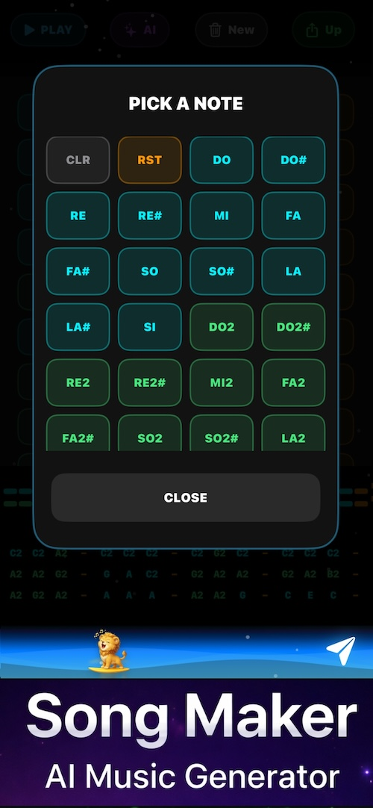
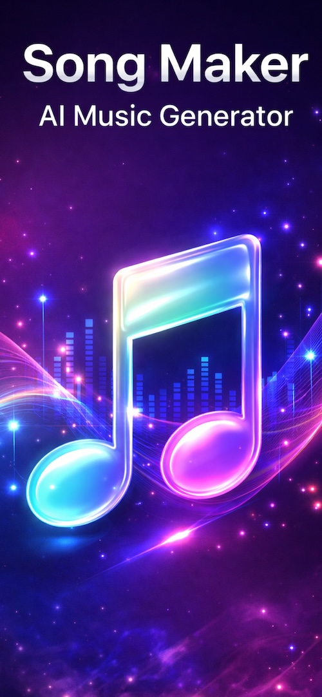

# 🎵 Song Maker AI Music Generator
### Simple Melody Composer

  

  <b>Create music easily — no musical background required.</b>

  <a href="https://apps.apple.com/app/song-maker-ai-music-generator/id6757778577">
    👉 Download on the App Store
  </a>

---

## ✨ About the App

**Song Maker AI Music Generator** makes music creation simple and accessible for everyone — no musical background required.

With a clean, beautiful interface and intuitive controls, you can easily create melodies using familiar **Do Re Mi** notes, or let **AI generate inspiring melodies** for you in seconds.

Whether you are a **beginner**, a **student**, or just **love music**, this app helps you turn ideas into sound effortlessly.

Create your own melodies step by step, experiment with **notes, rhythm, and speed**, then **save and share** your music with friends instantly.  
Song Maker is designed to feel **fun, creative, and stress-free** — making music something anyone can enjoy.

---

## 🧠 Key Features

- ▷ **AI Melody Generator** – Instantly create musical ideas  
- ▷ **Manual Composer** – Build melodies using simple Do Re Mi notes  
- ▷ **Beginner-Friendly** – No music theory needed  
- ▷ **Save & Share** – Keep your melodies and send them to friends  
- ▷ **Beautiful UI** – Clean, modern, and easy to use  

---

## 📸 App Preview

  
  
  

---

## 🚀 Get the App

👉 **App Store:**  
https://apps.apple.com/app/song-maker-ai-music-generator/id6757778577

---

## 💡 Designed For Everyone

- 🎹 Beginners with zero music knowledge  
- 🎓 Students learning melody & rhythm  
- 🎶 Music lovers who want fast inspiration  
- 🤖 Anyone curious about AI-generated music  

---

  Made with ❤️ to make music creation fun and easy for everyone.

